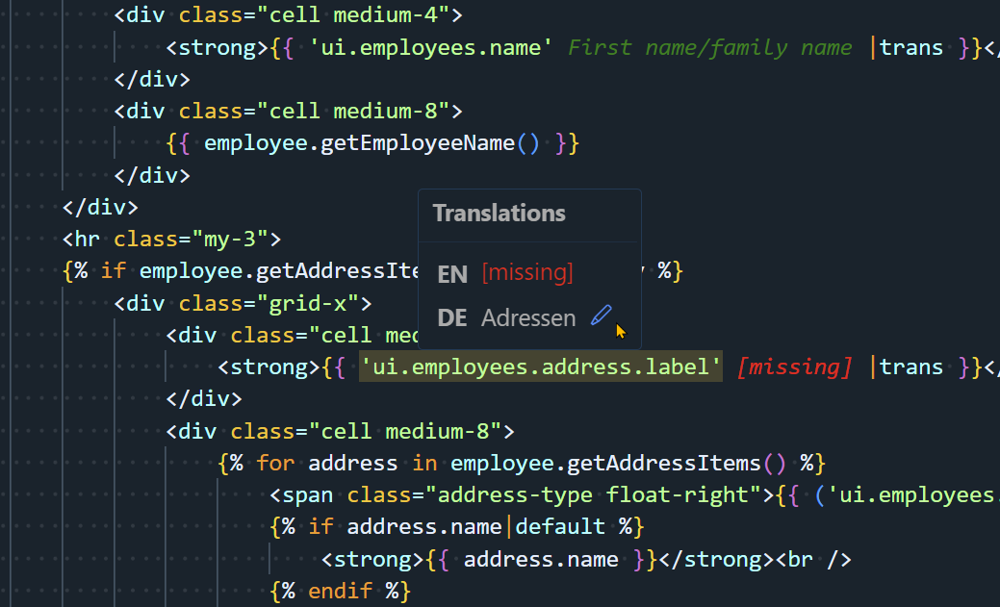

# Symfony Translation Helper for Visual Studio Code

Visualizes translated strings from YAML translation files in Symfony projects using Inline Decorations & Hover Support.

## Features

* Shows the translation of a translation key inline.  
* Adds a hover popup to a translation key that shows existing or missing translations for selected target languages.

## Extension Settings

This extension's default configuration should work for most Symfony projects. If you wish to alter its behavior, you can adjust the extension setting values:  

Open `File` -> `Preferences` -> `Settings` (`Ctrl` + `,`)  
Search for `symfonyTranslationHelper` to find the following settings:  

* `symfonyTranslationHelper.extensions`  
  Extensions of the files consuming translations, separated by semicolons.  
  *Example:* `php;twig`  
* `symfonyTranslationHelper.translationKeyPattern`  
  RegEx pattern used when searching translation keys in source code strings.  
  *Example:* `[a-zA-Z0-9._-]+` *Allows upper and lower case letters from a-z, numbers, dot (`.`), dash (`-`) and underscore (`_`) between one and unlimited times.*  
* `symfonyTranslationHelper.translationKeyMinLength`  
  Translation key minimum length, `0` for no minimum.  
  If a minimum length is given, shorter strings are ignored and not considered to be translation keys.  
* `symfonyTranslationHelper.translationFiles.patterns`  
  Filename pattern(s) of the translation file(s), separated by semicolons. Use `[LANG]` as language code placeholder.  
  *Example:* `messages.[LANG].yml` *Finds language files such as \"messages.en.yml\", \"messages.de.yml\" and so on.*  
* `symfonyTranslationHelper.translationFiles.folders`  
  Path(s) of the root folder(s) to recursively search for translation files, relative to the workspace root folder, separated by semicolons.  
  Paths listed here support glob placeholders. The pattern `**/Resources/translations` would search all translation folders in all bundles of the workspace. However, this search can be very slow. To speed up searching for translation files, using a list of more specific folders is highly recommended.  
  *Example:* `src/App/Resources/translations;src/AppBundle/Resources/translations`  
* `symfonyTranslationHelper.translationFiles.ignored`  
  Folder name(s) ignored when recursively looking for translation files, separated by semicolons.  
  *Example:* `vendor;.git;public`  
* `symfonyTranslationHelper.preview.enabled`  
  Whether inline translation previews are enabled.  
  Shows a specific translation of a translation key inline right after the key. See `symfonyTranslationHelper.preview.language` for choosing a translation language.  
* `symfonyTranslationHelper.preview.language`  
  Language to use for showing inline translation previews. If no translation for this language exists, inline translation won't be shown.  
  *Example:* `en`  
* `symfonyTranslationHelper.preview.color`  
  Color of the translation preview text (hex value or html color name).
  *Example:* `green`  
* `symfonyTranslationHelper.hover.enabled`  
  Whether hover popups with links to translation sources are enabled.  
* `symfonyTranslationHelper.requiredLanguages`  
  Required languages, separated by semicolons. Indicates missing translations for a found translation string.  
  *Example:* `en;de`  

## Known Issues & Limitations

* The first folder in your workspace will be searched for translation files only.  
* At least one translation in any language must exist for any translation key in your source code, so that this extension identifies it as translation and is able to indicate missing translations in other languages.  
* Twig `` tags are not supported yet.  
* Concatenated translation keys are not supported.  
* In some occasions, such as minimizing Visual Studio Code with an active editor tab containing translation key annotations, the annotations might be added twice. Switching the tab back and forth will remove duplicated annotations.  

## Release Notes

### 1.0.0

* Initial release.

## Credits

This extension is roughly based on the [Translation Keys Lookup](https://marketplace.visualstudio.com/items?itemName=matthizou.translation-keys-lookup) extension, but provides additional features, such as parsing nested translation keys in translation files, missing translation detection and providing links for found translation keys that open related translation files. For completeness, this extension still supports JSON translation files parsing. *With according pattern and file extension settings, it should still be usable and provide the same features for i18n JavaScript projects.*  
